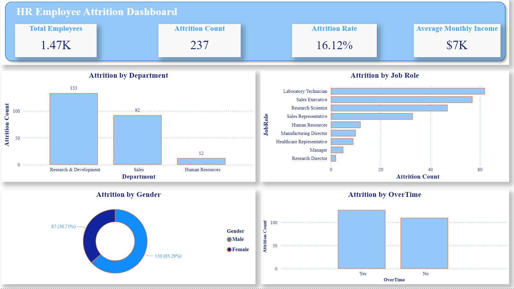

# HR Employee Attrition Dashboard

## Project Overview
This project analyzes employee attrition data using Power BI.  
The dashboard provides insights into total employees, attrition count, attrition rate, average monthly income, department-level attrition, job role attrition, gender distribution, and overtime impact.

## Dashboard Preview

## Key Questions
- What is the overall attrition rate?
- Which department has the highest attrition?
- Which job roles are most affected by attrition?
- How does attrition differ by gender?
- How does overtime relate to employee attrition?

## Key Insights
- The total number of employees is 1.47K.
- The attrition count is 237.
- The attrition rate is 16.12%.
- Research & Development has the highest attrition count.
- Laboratory Technician and Sales Executive roles show high attrition.
- Employees working overtime have higher attrition compared to employees without overtime.

## Tools Used
- Power BI
- Power Query
- DAX
- Excel / CSV Dataset

## Files
- `HR Employee Attrition Dashboard.pbix`: Power BI dashboard file
- `hr_dashboard.png`: Dashboard screenshot
- `sample_hr_employee_attrition.xlsx`: Sample dataset used for preview

## Author
Hanin Alaslani
